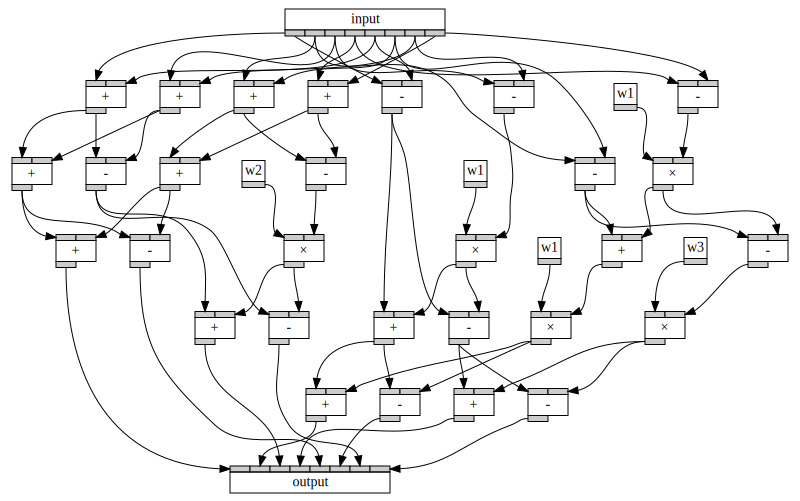

# FFT generator prototype

A series of experiments for code generation of FFT codes.

* Prototype written in R6RS scheme, generates graphs

* Adaptation of FFTW3
* Python interface to FFTW3 codelet generator

## Dependencies

* Scheme prototype

    - R6RS Scheme, either Guile 2 or Chez Scheme.
    - Graphviz

* GenFFT

    - OCAML
    - OCAML build (`apt install ocamlbuild`)

* Codelet runner

    - enTangleD (https://jhidding.github.io/enTangleD)
    - Python, NumPy, Noodles, pyParsing, pyOpenCL
    - indent utility (`apt install indent`)

## Building / Running

This repository contains a modified version of FFTW3's GenFFT. This is located in the `genfft` folder. To build this, you need OCAML and OCAML build installed. On Debian/Ubuntu based systems,

    apt install build-essential ocaml ocamlbuild

Then, in the `genfft` folder:

    make
    
This creates a lot of executables called `gen_*.native` in the `genfft/_build` folder, and makes symlinks in `genfft`.

To run the Python based interface (located in `fftw`) to the code generators, the dependencies are as follows:

* Python 3.6/3.7
* NumPy - what else
* Noodles - for parallel execution and caching of codelet generation and building
* PyParsing
* PyOpenCL

To install these in one go, from the `fftw` folder

    pip install -r requirements.txt

There is an example program that generates a $n=12$ OpenCL kernel

    python -m genfft.opencl

### Tests

For unit tests, run `make test`.

